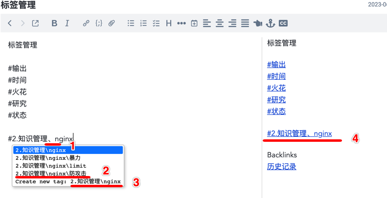

# joplin-plugin-taglevel
a plugin with '#' to add tag and support level and click

优先更新地址：https://gitee.com/shoko/joplin-plugin-taglevel

#### 介绍
Joplin 插件，来源于插件 joplin-inline-tags-plugin

通过‘#’，添加标签关联。增加了：

1. 支持标签层级
2. 支持添加层级下标签，多层级多个标签
3. 支持标签点击

a Joplin plugin with '#' to add tag and support level and click

1. 友好中文支持，'、'同'\'
2. 标签支持层级展示
3. 标签支持创建子级标签
4. 标签支持点击

#### 安装教程

1.  直接使用，下载publish目录的2个文件，直接添加即可
2.  二次开发，下载源码

#### 鸣谢
感谢：https://github.com/roman-r-m/joplin-inline-tags-plugin
